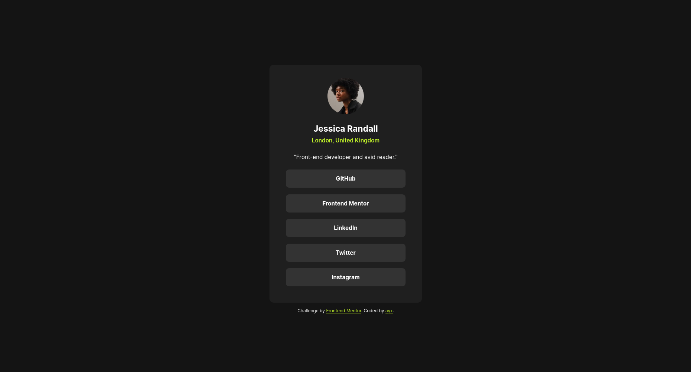

<!-- @format -->

# Frontend Mentor - Social links profile solution

This is a solution to the [Social links profile challenge on Frontend Mentor](https://www.frontendmentor.io/challenges/social-links-profile-UG32l9m6dQ)

## Table of contents

-   [Overview](#overview)
    -   [The challenge](#the-challenge)
    -   [Screenshot](#screenshot)
    -   [Links](#links)
-   [My process](#my-process)
    -   [Built with](#built-with)
    -   [What I learned](#what-i-learned)
    -   [Continued development](#continued-development)
    -   [Useful resources](#useful-resources)
-   [Author](#author)

## Overview

### The challenge

Users should be able to:

-   See hover and focus states for all interactive elements on the page

### Screenshot

### Links

-   Solution URL: [Solution URL](https://github.com/ayx234/FM_Social_Links_Profile)
-   Live Site URL: [Live site URL](https://ayx234.github.io/FM_Social_Links_Profile)

## My process

### Built with

-   Semantic HTML5 markup
-   CSS custom properties
-   Flexbox
-   Mobile-first workflow

### What I learned

HTML:

-   Use `aria-label` for non-semantic elements, such as `` and `
`, that include content for the user. This will be used by assistive technologies to tell the user about the type of the content it contains.
    -   Doesn't apply to decorative/styling elements.
-   Use `tabindex="0` for elements that have self-contained content such as `article`.
    -   Enables navigation to the element through tabbing.

### Continued development

-   CSS flexbox and grid
-   Other layout material

### Useful resources

-   [CSS Reset - Josh Comeau](https://www.joshwcomeau.com/css/custom-css-reset/) - Updated May 9th, 2025.

## Author

-   Frontend Mentor - [@ayx234](https://www.frontendmentor.io/profile/ayx234)
